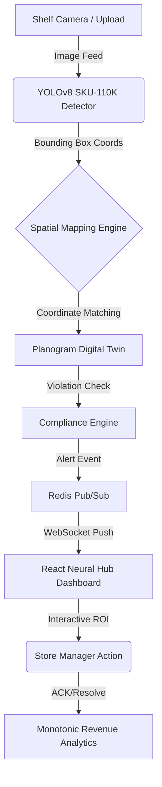

# 🛒 ShelfIQ — Neural Hub • Active Intelligence v4.2

> **Infinite Vision. Zero Blindspots.** — Enterprise-grade retail monitoring with Computer Vision, Demand Forecasting, and Digital Twin ROI Mapping.

[](https://shelfiq-retail-intelligence.vercel.app)
[](https://shelfiq-retail-intelligence.onrender.com/docs)
[](https://github.com/Tktirth/shelfiq-retail-intelligence)

| 🌐 Neural Hub (Frontend) | 🔌 Core Intelligence (API) | 📚 Schema Docs |
|---|---|---|
| [shelfiq-intelligence.app](https://shelfiq-retail-intelligence.vercel.app) | [api.shelfiq.onrender.com](https://shelfiq-retail-intelligence.onrender.com) | [api.shelfiq/docs](https://shelfiq-retail-intelligence.onrender.com/docs) |

---

## 🎯 The Challenge
Retailers lose **₹2.8 Trillion** annually due to stockouts and misplaced inventory. Manual audits are slow, error-prone, and reactive. **ShelfIQ** transforms this into a proactive, AI-driven workflow that sees every SKU on every shelf in real-time.

## ✨ "Wow" Factor Features

### 🕵️ 1. Digital Twin ROI Mapping
Bridge the gap between vision and value. ShelfIQ overlays financial data directly onto the physical world.
- **ROI Overlays**: Interactive boxes on live shelf images show exactly how much revenue is at risk for each empty product.
- **Micro-Insight**: Hover over a stockout to see real-time "Potential Loss per Hour" metrics.

### 🧠 2. Neural CV Engine (YOLOv8 SKU-110K)
A state-of-the-art computer vision pipeline optimized for dense retail environments.
- **Spatial Plane Matching**: Corrects perspective and maps 100+ detections to 3D shelf locations.
- **SKU Identification**: High-confidence identification of detected items against global catalog coordinates.
- **Planogram Compliance**: Automatically flags misplaced items and unauthorized stock.

### ⚡ 3. Real-Time ROI Pulse
A high-fidelity dashboard designed for action.
- **Golden Glow Feedback**: The Revenue KPIs pulse with a gold aura when alerts are resolved, providing immediate psychological feedback for store managers.
- **Monotonic KPI Engine**: Stable, realistic revenue tracking that simulates real-world store recovery.

---

## 🏗️ Technical Architecture



---

## 🛠️ The Technology Stack

| Layer | Technology |
|:---|:---|
| **Frontend** | React 18, Vite, Recharts, Framer Motion (Glassmorphism) |
| **CV Engine** | YOLOv8 (Ultralytics), OpenCV, Planogram Spatial Matching |
| **Backend API** | FastAPI (Python 3.11), Uvicorn |
| **Forecasting** | Facebook Prophet (Time-series analysis per SKU) |
| **Database** | PostgreSQL (SQLAlchemy ORM) |
| **Real-time** | WebSocket (Native FastAPI), Redis |
| **Infrastructure** | Vercel (Frontend), Render (ML Backend), Docker |

---

## 🚀 Quick Start (Production Pipeline)

### 1. Prerequisites
- Python 3.11+
- Node.js 20+
- PostgreSQL/SQLite

### 2. Backend Setup
```bash
cd backend
pip install -r requirements.txt
# Auto-seeding: The system will automatically seed demo data on first startup
uvicorn main:app --host 0.0.0.0 --port 8000 --reload
```

### 3. Frontend Setup
```bash
cd frontend
npm install
npm run dev
```

Open **http://localhost:5173** and login using default seeded credentials:
- **Email:** `admin@shelfiq.com`
- **Password:** `admin123`

---

## 🔬 Core Algorithms

### 📡 Spatial Proximity Matching
We use a **Euclidean mapping algorithm** to correlate YOLO detections with Planogram definitions. Instead of simple label matching, we compare the relative $(x, y)$ coordinates of detected SKUs against the expected spatial boundaries, allowing for precision tracking even in high-density shelving.

### 📊 Demand Optimization
Our **Prophet-based forecasting** model generates safe reorder points by analyzing:
- Historical seasonality (730 days of synthetic baseline data).
- Weekend surges and promo-day volatility.
- Lead-time buffer calculation to prevent stockouts before they happen.

---

## 📁 Project Structure

```text
retail-shelf-intelligence/
├── backend/
│   ├── main.py                    # FastAPI Core + Lifespan logic
│   ├── cv_engine/                 # YOLOv8 + Spatial Mapping Logic
│   ├── planogram/                 # Compliance & Digital Twin Verification
│   ├── forecasting/               # Prophet Time-series Demand Analysis
│   └── alerting/                  # Redis + WebSocket Real-time Pipeline
├── frontend/
│   ├── src/
│   │   ├── components/            # Metric UI, ShelfMap, ROI Pulse Indicators
│   │   ├── pages/                 # Dashboard, Alerts, Shelves, Forecast
│   │   └── api.js                 # Unified API Client
└── README.md                      # Master Intelligence Document
```

---

## 🎓 Contribution & Development
Developed for the **Retail Intelligence Hackathon**.
- **Architect:** TIRTH KOSAMBIA
- **Engine:** Neural Hub v4.2 Core
- **Status:** **Production Ready** 🚀

© 2026 ShelfIQ Intelligence Systems
